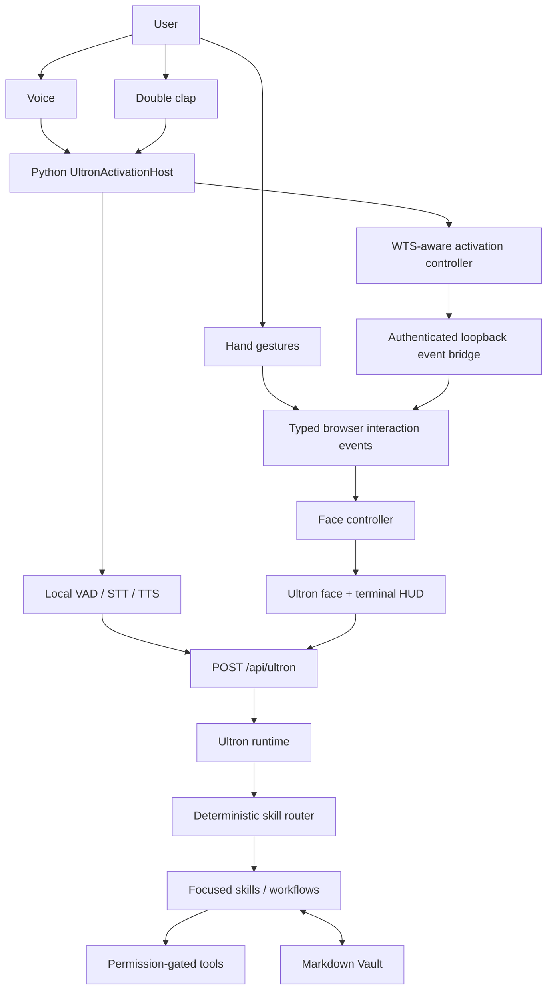

# Personal AI OS Architecture

## Purpose and current boundary

Ultron is one orchestration layer for skills, tools, memory, and natural interaction. Voice, hand gestures, and clap activation are input methods for the same core. The restored yellow/orange structure is the shared visual state surface.

The repository currently contains a working browser HUD, face, browser-local gestures, skill runtime, Vault, local speech pipeline, speaker enrollment, and a composed per-user Windows activation host. `scripts/start-ultron.ps1` launches the host manually; nothing is registered at Windows startup. The locked-session prototype never unlocks Windows.

## System map



Authentication audio, speaker embeddings, challenges, detailed scores, phrases, and diagnostic reasons do not enter the browser bridge, the Vault, or an LLM path. Only coarse prototype pass/fail state may cross the bridge so the face can reflect the interaction state; it grants no authority.

## Important modules

| Area | Location | Responsibility |
| --- | --- | --- |
| HUD | `components/AssistantOrb.tsx`, `components/HudStatusPanels.tsx` | Keeps the face dominant, exposes state, and shows camera/gesture status |
| Face renderer | `lib/orbScene.ts` | Original procedural yellow/orange WebGL structure, animation, pointer/touch controls, and render resilience |
| Face state | `lib/faceState.ts`, `interaction/face/` | Central state/signals API and event-to-renderer binding |
| Gestures | `lib/handTracker.ts`, `interaction/gesture/` | MediaPipe camera tracking, pure gesture intents, and normalized events |
| Browser events | `interaction/events.ts` | Typed in-process `on`, `off`, and `emit` contract for all interaction families |
| Native bridge | `components/NativeInteractionBridge.tsx`, `app/api/interaction/route.ts`, `core/interactionState.ts`, `core/localHttp.ts` | Loopback-only, token-gated projection of coarse native events into the HUD |
| Conversation UI | `components/AssistantConsole.tsx` | Text requests, structured responses, and confirmation cards |
| AI API | `app/api/ultron/route.ts` | Validates local requests and returns runtime responses |
| Runtime | `core/runtime.ts` | Dependency wiring, execution, morning workflow, and graceful failures |
| Conversation brain | `core/brain.ts`, `core/llm.ts` | Stateless Responses API requests, bounded tool loop, safe failure handling, and approved Vault context |
| Working memory | `core/conversationMemory.ts`, `app/api/conversation/route.ts` | Bounded RAM-only voice/text history, cancellation, clearing, and same-origin local access |
| Skills and routing | `core/skills/` | Focused jobs, typed results, registration, and deterministic intent routing |
| Tools and permissions | `core/tools.ts`, `core/permissions.ts` | Reusable external actions and scope-specific confirmation |
| Vault | `core/vault.ts`, private `.ultron/vault/` | Atomic Markdown persistence, discovery, validation, wikilinks, index, and changelog |
| Configuration | `core/config.ts` | Validated environment settings with no embedded credentials |
| Observability | `core/observability.ts` | Safe route, skill, tool, duration, and error logging |
| Voice | `voice/` | Local STT/VAD/TTS, clap, speaker verification, authentication, and Windows activation seams |
| Activation host | `voice/run_background.py`, `voice/background_agent.py`, `voice/wake_word.py` | Composes one microphone stream, clap/wake detection, WTS routing, HUD activation, and deferred voice/authentication |
| Manual launcher | `scripts/start-ultron.ps1`, `scripts/stop-ultron.ps1` | Starts/stops the Next node server and Python `UltronActivationHost`; stores ignored logs and process fingerprints only |
| Tests | `tests/`, `voice/tests/` | Hardware-free unit/integration coverage with mocked browser, audio, and Windows boundaries |

## Unified interaction events

`interaction/events.ts` is the browser's small typed event bus. Payloads are serializable. Detectors publish facts; controllers decide what those facts mean; renderers consume only normalized state. This keeps camera tracking, authentication, and audio code out of face rendering.

The contract covers these event families:

- `camera.state_changed`
- `gesture.detected`
- `face.state_changed`, `face.signals_changed`, and renderer status
- `voice.wake_detected`, `voice.listening`, `voice.transcribing`, and `voice.speaking`
- `clap.activation_detected` (`clap.double_detected` remains a compatibility event)
- authentication start/success/failure events
- `hud.open_requested`

The Python host now produces coarse wake, clap, voice-state, HUD, and prototype-authentication events. The larger type map remains an extension seam and does not imply native OS authentication.

### Face state ownership

`faceController` is the central writer for:

```text
idle
listening
transcribing
thinking
working
speaking
gesture_active
authenticating
error
offline
```

It also owns bounded `audioLevel`, `gestureEnergy`, and `intensity` signals. The event-to-renderer binding maps gesture, voice, clap, authentication, and renderer-health events to that API. Components should not manipulate WebGL materials directly.

The face remains mounted when camera initialization, MediaPipe, or renderer setup fails. Failures are reflected as status/state instead of replacing the face with a gesture error screen.

### Gesture boundary and exact vocabulary

MediaPipe hand landmark processing stays in `lib/handTracker.ts`. Classification and intent live under `interaction/gesture/`. The original vocabulary is preserved exactly:

1. One pinched hand (thumb plus index finger) moved across the frame emits a spin/rotation intent.
2. Two pinched hands spreading apart or closing together emit a zoom intent.

The internal gesture modes are only `idle`, `spin`, and `zoom`. There is no gesture-based authentication and no invented select, dismiss, or system-write gesture. Camera frames remain in the browser and are not posted to Ultron APIs. The UI shows `CAMERA` and `GESTURES` readiness and lets the user toggle tracking with `G`. Reviewed MediaPipe 0.10.35 WebAssembly files and the pinned hand model are served same-origin from `public/mediapipe/`; `ASSETS.md` records their hashes/source and `LICENSE.txt` preserves the upstream Apache 2.0 terms. Gesture initialization therefore needs no runtime CDN fetch.

## Native event bridge

Native Python components may POST a narrow allowlist of coarse events to `/api/interaction`; the browser polls the same loopback route for newer sequence numbers. The route accepts loopback clients only. POST is disabled unless `ULTRON_LOCAL_EVENT_TOKEN` is configured, and the bearer token must contain at least 32 characters.

The manual launcher generates a fresh random 32-byte token in memory for each run. The Next and Python child processes inherit the same value. It is not written to `.env.local`, runtime state, or logs; the launcher's previous environment value is restored after process creation. A manually composed host outside that launcher must still provide its own matching high-entropy token.

The projector deliberately excludes raw audio, authentication transcripts, challenge phrases, biometric embeddings, similarity/liveness scores, detailed decisions, and diagnostic reasons. It permits only coarse non-authoritative prototype pass/fail state for face feedback. The token is transport security state, not AI memory; keep it in `.env.local` and the native process environment only.

## Skills and tools

A skill decides what the user needs and formats the result. It does not contain service authentication or deeply embedded API mechanics. Each skill returns a concise human view and typed machine-readable data.

A tool performs one external action. It declares a stable name, permission scope, risk level, and input/output contract. Skills invoke tools only through `ToolRegistry`.

The initial skills are:

- `vault`: save, search, list, update, and forget user-controlled context
- `inbox`: rank the three stored items that most need attention
- `metrics`: summarize configured GitHub data and manually recorded metric snapshots
- `trends`: report only meaningful deltas between stored scans
- `plan`: select up to three outcome-oriented priorities and persist the daily plan

`Good morning` invokes `inbox -> metrics -> trends -> plan`, then persists a small briefing. Skills exchange request-scoped structured results rather than replaying a massive conversation.

## Memory and authentication storage

- Working memory is the current request and its in-process results. It disappears after execution.
- Persistent AI memory is stable user context in `.ultron/vault/wiki/` by default.
- Raw evidence is preserved in `.ultron/vault/raw/` by default.
- Dated plans, briefings, metrics, and trends live in `.ultron/vault/outputs/` by default.
- Permission grants live separately in `.ultron/state/permissions.json`.
- Speaker profiles and security events live separately under `%LOCALAPPDATA%\Ultron\Auth\` and use current-user Windows DPAPI.

The Vault initializes its empty `raw/`, `wiki/`, and `outputs/` structure plus `INDEX.md`, `CHANGELOG.md`, and `AGENTS.md` on first use. Personal profiles, projects, permission preferences, plans, and trend snapshots are local user data and are not repository templates. Both the default `.ultron/vault/` path and the legacy repository-root `/vault/` path are ignored by Git. Existing legacy files are left in place; a user may explicitly point `ULTRON_VAULT_DIR` at that directory or privately migrate them.

The Markdown Vault is the canonical user-controlled knowledge source. It must never contain passwords, OTPs, API keys, bank details, speaker embeddings, authentication audio, or anything marked not to remember. Authentication storage is a separate security boundary, not another memory category.

## Permission model

Each tool action is classified as:

- `read`: retrieves information without changing the external service
- `reversible_write`: changes external state that can normally be undone
- `consequential_write`: sends, deletes, publishes, deploys, pays, or performs another high-impact action

Read actions ask for a confirmation bound to the exact tool, input, and original request; a remembered read grant remains narrow and revocable. Reversible and consequential writes require a separate trusted confirmation channel and currently fail closed, so the loopback command API cannot authorize them. Gesture or voice input never bypasses this service.

Writing inside the configured Vault is an internal operation. Other filesystem destinations require a description of what, where, and why before writing.

## Configuration and credentials

| Variable | Required | Purpose |
| --- | --- | --- |
| `ULTRON_DATA_DIR` | No | Private local state directory; defaults to `.ultron` |
| `ULTRON_VAULT_DIR` | No | Private Markdown knowledge directory; defaults to `.ultron/vault` |
| `ULTRON_TIMEZONE` | No | IANA timezone used by plans; defaults to the system timezone |
| `ULTRON_GITHUB_REPOSITORIES` | For GitHub metrics | Comma-separated `owner/repository` names |
| `ULTRON_SPEAKER_NAME` | For speaker auth | Private enrolled display name; there is no repository default |
| `GITHUB_TOKEN` | No for public repos | Raises API limits and later enables private-repository reads |
| `ULTRON_VOICE_MODEL_DIR` | No | Private cache for optional local STT, VAD, TTS, and speaker models |
| `ULTRON_LOCAL_EVENT_TOKEN` | No | Enables authenticated loopback native-event POSTs; the launcher supplies an ephemeral value automatically |

Credentials are server/native-process configuration only. They must remain in `.env.local` or an operating-system credential manager, never prompts, logs, source, or the Vault. Leaving `ULTRON_LOCAL_EVENT_TOKEN` empty keeps event POSTs disabled when processes are started separately; the manual launcher overrides that blank value only in its child-process environments.

## Integration status

| Source or subsystem | Status | Behavior now |
| --- | --- | --- |
| Face and HUD | Working | Restored procedural structure, centralized states, HUD panels, and resilient rendering |
| Hand gestures | Working in browser | Original one-hand spin and two-hand zoom; local camera processing and explicit permission |
| Markdown Vault | Working | Validated Markdown pages with index/changelog maintenance |
| GitHub repository metrics | Working | Real API reads after permission confirmation |
| Gmail / Outlook / college notices | Not connected | Inbox reports missing connectors; no messages are invented |
| WhatsApp | Not connected | No automatic reads or replies |
| Calendar | Not connected | No meetings are invented |
| Portfolio analytics | Not connected | Metrics can use manual snapshots only |
| News and web sources | Not connected | Trends compares stored snapshots only |
| Local conversational voice | Composed manual host | CPU-only Silero, faster-whisper, loopback core, and Kokoro Michael are connected for wake and on-demand turns |
| Speaker enrollment | Working locally | Multi-sample WeSpeaker embedding stored with user-scoped DPAPI |
| Double clap / Windows activation | Manually runnable | `start-ultron.ps1` launches the detector, WTS observer, warm HUD controller, and deferred listening/authentication |
| Locked Windows authentication | Prototype only | Challenge/liveness/speaker flow cannot unlock the OS and always requires native sign-in |
| Conversational LLM | Implemented; key required | OpenAI Responses API, configurable model, text drafting/translation, temporary history, and approved Vault search |
| Coding execution | Deferred | No shell/file-edit/commit tools exposed to the model |

## Local voice pipeline

The intended conversational path is:

```text
microphone -> Silero VAD -> faster-whisper STT -> /api/ultron
           -> response.human -> Kokoro TTS (am_michael)
```

`voice/conversation.py` composes one normal turn and supports direct, wake-word-prefixed, and clap-activated modes (the internal compatibility enum remains `double_clap`). It deletes the temporary utterance WAV before calling the core, sends only accepted conversational text to the loopback API, speaks the human response locally, and publishes coarse listening/transcribing/speaking state. Audio is not written to the Vault.

The running host uses one 16 kHz microphone stream for both activators. `SherpaSileroFrameVad` endpoints possible wake phrases; `BoundedWakeTranscriber` asynchronously runs local faster-whisper `small` CPU-int8 inference for at most one candidate at a time and drops later candidates while busy. A transcript beginning with `Ultron` becomes only `voice.wake_detected`; the transcript itself is discarded and never sent over the HUD bridge. The controller then opens the HUD and records a separate command utterance. This is local speech endpointing plus Whisper recognition, not a dedicated low-power keyword model. TTS suppresses and resets both clap and wake paths. Barge-in is not implemented, and wake activation is rejected while Windows is locked.

## Double-clap and Windows activation

The lightweight detector evaluates energy, impulse/crest characteristics, frequency distribution, inter-clap timing, and cooldown. Detection is suppressed while TTS is active and for a short post-playback window.

The running per-user path is:

```text
16 kHz microphone frames
  -> clap detector
  -> activation controller
  -> WTS locked / unlocked / unknown state
     -> unlocked: show warm Edge app-mode HUD, then request listening
     -> locked: start local authentication prototype
     -> unknown: fail closed
```

The Windows layer uses [WTS session notifications](https://learn.microsoft.com/en-us/windows/win32/api/wtsapi32/nf-wtsapi32-wtsregistersessionnotification) for lock state and supported Win32 window-management calls for HUD visibility. It does not infer lock state from the visible window or generate keyboard/mouse input. Windows intentionally restricts which processes may call [SetForegroundWindow](https://learn.microsoft.com/en-us/windows/win32/api/winuser/nf-winuser-setforegroundwindow), so the HUD controller falls back to a brief non-input topmost visibility pulse when foreground focus is denied.

`scripts/start-ultron.ps1` starts the loopback Next node server, waits for its token-authenticated interaction API, then starts Python `UltronActivationHost`. The launcher creates an ephemeral event token, records only process IDs, executable paths, start times, and a repository fingerprint in `.ultron/runtime/processes.json`, and redirects logs to `server.*.log` and `activation.*.log` in that ignored directory. `scripts/stop-ultron.ps1` verifies those fingerprints before terminating both recorded process trees and removing the state file. The launch remains manual and installs no Windows service, scheduled task, startup item, Registry entry, or Credential Provider.

### Startup approval rule

Startup persistence must never be silently added. Before registration, present the exact process/executable, microphone responsibility, expected resource use, startup mechanism, and disable/removal procedure. Register only after explicit user approval.

## Speaker verification and Windows security

Enrollment uses multiple varied phrases and averages normalized WeSpeaker embeddings. Raw enrollment recordings are temporary and are not part of the stored profile. The protected profile and safe-field-only security event log use current-user DPAPI outside the Vault.

Practical commands:

```powershell
python -m voice.interactive_enrollment --name "Your Name"
python -m voice.authenticate_speaker --name "Your Name"
```

The second command exercises the speaker/challenge flow locally and deliberately cannot unlock Windows.

The authentication prototype combines:

- expected identity claim handling;
- speaker similarity;
- a randomized five-token spoken challenge sampled without replacement from 128 distinct words;
- a liveness/replay-protection interface;
- timeout and conservative failure behavior; and
- progressive throttling and temporary lockout.

It fails closed for wrong/uncertain voices, challenge mismatch, suspected replay, missing audio, timeout, unknown lock state, or storage failure. It does not disclose detailed thresholds to an unauthenticated speaker. The present liveness component is a conservative audio-quality heuristic, not production-grade or certified replay/anti-spoofing protection.

`AuthenticationDecision.allows_os_unlock` remains `False`. A normal desktop process cannot authorize the Windows secure desktop or programmatically bypass Windows authentication. Windows interactive sign-in is mediated by Winlogon, Logon UI, Credential Providers, LSA, and authentication packages; see Microsoft's [credential process architecture](https://learn.microsoft.com/en-us/windows-server/security/windows-authentication/credentials-processes-in-windows-authentication) and [Credential Provider guidance](https://learn.microsoft.com/en-us/windows/win32/secauthn/credential-providers-in-windows). A future integration would therefore be a separate reviewed, installed, and signed native security project. The older [Windows Hello Companion Device Framework is deprecated](https://learn.microsoft.com/en-us/windows-hardware/design/device-experiences/windows-hello-companion-device-framework) and is not a viable shortcut. Windows passwords must never be stored, injected, logged, or sent as simulated input.

## Model and license boundary

Third-party speech software and downloaded model artifacts retain their own licenses. See [voice/THIRD_PARTY_MODELS.md](../voice/THIRD_PARTY_MODELS.md) and [voice development](../voice/README.md) for model sources, checksums, and attribution. The original interface lineage and MIT notice remain documented in the root README and LICENSE.

## Add a skill

1. Create one small module in `core/skills/` returning a `SkillDefinition`.
2. Define distinctive route phrases and structured output data.
3. Reuse Vault and tools through `SkillExecutionContext`.
4. Register the skill in `UltronRuntime`.
5. Add discovery, routing, success, and graceful-failure tests.

Avoid global prompt growth. A future model router may handle ambiguity, but deterministic routes should remain available for common commands.

## Add an interaction source

1. Keep hardware capture and classification in an isolated adapter.
2. Emit a small serializable fact through the typed event contract.
3. Put policy and routing in a controller, not the detector or renderer.
4. Project only coarse, allowlisted native events across the loopback bridge.
5. Add mocks for unavailable hardware, failure, cooldown, and coexistence behavior.
6. Preserve the permission and authentication boundaries.

## Add an integration

1. Put service mechanics in `core/integrations/`, not a skill prompt.
2. Define the narrow tool, including risk and permission scope.
3. Load credentials through validated server configuration.
4. Register the tool in the runtime and invoke it from relevant skills.
5. Test denial, one-time confirmation, remembered grants, service errors, and redaction.

## Development and testing

```powershell
npm run typecheck
npm test
npm run test:launcher
npm run build
```

`npm test` includes the Node/TypeScript and Python voice suites. On Windows, `npm run verify:windows` additionally runs launcher lifecycle tests and the production build.

The TypeScript tests cover skill discovery/routing, permissions, Vault behavior, face state, gesture classification, event propagation, and loopback projection. The Python voice suite currently contains more than 49 cases, plus the TypeScript tests; the exact count is expected to grow. Python coverage includes the composed host, bounded wake worker, wake/clap coexistence, temporary-file deletion, TTS suppression, lock routing, WTS mapping, HUD activation fallbacks, missing microphones, speaker enrollment, protected storage, locked-auth workflow, challenge failure, liveness heuristic, timeout, throttling, and mailbox communication.

Automated tests mock hardware and OS boundaries. Real camera, microphone, foreground-window, and audio quality checks are separate manual integration work and should be run deliberately on the target PC.

## Next architectural steps

1. Perform deliberate manual clap/HUD, wake-word, camera/gesture, and audio-device tests on the target Windows PC.
2. Tune clap and wake thresholds against real-room false positives and measure host resource use.
3. Add barge-in only after the shared TTS suppression and microphone ownership behavior remain reliable.
4. Replace or augment the liveness heuristic with a reviewed production local anti-spoofing design and complete an authentication-only evaluation.
5. Treat native Windows sign-in as a separate signed security project; do not add an unlock workaround.
6. Add authenticated read-only Inbox connectors for the services actually used.
